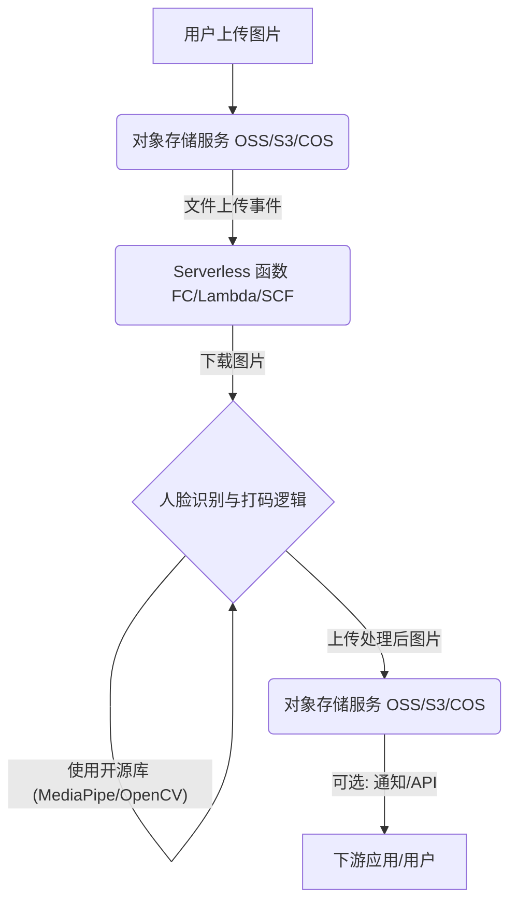

# 批量大并发、低成本、快速上线图片人脸识别打码方案建议

## 摘要

针对用户对图片人脸识别打码（马赛克/模糊处理）提出的“批量大并发、最省成本、最快上线”需求，本报告提出并详细阐述了一套基于 **Serverless 计算服务与开源人脸识别模型**相结合的解决方案。该方案通过云服务的弹性伸缩能力应对高并发，利用开源模型的免费特性降低成本，并通过无服务器架构简化部署流程，实现快速上线。

## 1. 核心需求分析

在设计方案之前，我们首先明确用户提出的三个核心需求：

*   **批量大并发**：系统需要能够处理大量图片，并在短时间内完成人脸识别和打码操作，具备高吞吐量和弹性伸缩能力。
*   **最省成本**：在满足性能要求的前提下，尽可能降低运营成本，包括计算资源、API 调用费用等。
*   **最快上线**：方案应易于部署和维护，缩短从开发到生产环境的周期。

## 2. 方案架构：Serverless + 开源模型

综合考虑上述需求，我们推荐采用 **“对象存储 + Serverless 函数 + 开源人脸识别库”** 的架构模式。该架构的核心思想是将图片处理逻辑封装在无服务器函数中，并由对象存储的事件触发，从而实现按需计算、自动扩缩容和极致成本效益。

### 2.1 架构图

### 2.2 架构组件说明

1.  **对象存储服务 (Object Storage Service)**：
    *   **作用**：作为图片上传的入口和处理结果的存储地。用户将原始图片上传至指定存储桶，处理后的图片则存储在另一个存储桶或同一存储桶的不同路径下。
    *   **优势**：高可用、高可靠、低成本存储，并能与 Serverless 函数无缝集成，通过事件通知触发后续处理。
    *   **示例**：阿里云 OSS、腾讯云 COS、AWS S3。

2.  **Serverless 函数 (Serverless Function)**：
    *   **作用**：核心计算单元，承载人脸识别和打码的业务逻辑。当对象存储中发生文件上传事件时，自动触发函数执行。
    *   **优势**：
        *   **弹性伸缩**：根据请求量自动扩缩容，无需预置服务器，完美应对高并发场景。
        *   **按量付费**：只为实际的代码执行时间付费，无空闲资源成本，实现极致成本控制。
        *   **快速部署**：只需上传代码包，云平台负责运行环境和基础设施管理，大大缩短上线时间。
    *   **示例**：阿里云函数计算 (Function Compute, FC) [1] [2] [3] [4] [5] [6]、AWS Lambda [7] [10]、腾讯云云函数 (SCF)。

3.  **开源人脸识别库 (Open-source Face Detection Library)**：
    *   **作用**：在 Serverless 函数中执行具体的人脸检测和打码算法。
    *   **优势**：
        *   **零 API 调用成本**：避免了商业 API 按次计费的模式，显著降低大批量处理的成本。
        *   **高度灵活性**：可以根据需求选择不同算法（如更注重速度或准确性），并进行定制化优化。
        *   **数据隐私**：图片数据无需传输到第三方 API 服务商，在用户自己的云环境中完成处理，提升数据安全性。
    *   **推荐库**：
        *   **MediaPipe**：Google 开源的跨平台机器学习框架，提供高性能的人脸检测和关键点模型，尤其适合实时处理和移动端部署 [13]。
        *   **OpenCV**：功能强大的计算机视觉库，提供多种人脸检测算法（如 Haar Cascade、DNN 模块），通用性强 [1] [6]。

### 2.3 打码实现方式

在检测到人脸区域后，可以采用以下常见打码方式：

*   **高斯模糊 (Gaussian Blur)**：通过对人脸区域应用高斯模糊滤镜，使人脸特征变得模糊不清，同时保持一定的自然过渡。
*   **马赛克 (Pixelation)**：将人脸区域的像素块化，形成马赛克效果，隐私保护效果显著。
*   **纯色遮盖 (Solid Color Block)**：直接用一个纯色块覆盖人脸区域，最简单直接的打码方式。

## 3. 方案优势与对比

| 特性 | 商业 API (直接调用) | Serverless + 开源模型 | 传统服务器部署 (自建) |
|---|---|---|---|
| **批量大并发** | 依赖服务商并发能力，可能受限 | **极佳**，Serverless 自动弹性伸缩 | 需手动配置和维护集群，扩缩容复杂 |
| **最省成本** | 按次计费，大批量成本高 [8] [9] [11] [12] | **极佳**，按需付费，无 API 调用费 [5] [6] | 需支付固定服务器费用，资源利用率低时成本高 |
| **最快上线** | 快速集成，但需关注 API 文档和鉴权 | **极佳**，代码部署，云平台管理基础设施 | 需采购、配置、部署服务器和环境，耗时 |
| **数据隐私** | 数据需传输至第三方 API 服务商 | **极佳**，数据在用户云环境内处理 | 数据在用户自建环境中处理 |
| **灵活性** | 受限于 API 功能 | **极佳**，可深度定制算法和效果 | 极佳，但开发和维护成本高 |
| **维护成本** | 低，服务商负责 | **低**，云平台负责基础设施，只需维护代码 | 高，需负责所有基础设施和代码维护 |

## 4. 实施建议

1.  **选择云平台**：根据现有云资源、团队熟悉度以及成本偏好，选择阿里云、腾讯云或 AWS 等主流云服务商。
2.  **准备开发环境**：安装 Python (推荐 3.8+), OpenCV, MediaPipe 等库。
3.  **编写函数代码**：
    *   使用 Python 编写 Serverless 函数，实现从对象存储下载图片、调用 MediaPipe 或 OpenCV 进行人脸检测和打码、将处理后的图片上传回对象存储的逻辑。
    *   优化代码，确保函数执行时间短、内存占用小，以降低运行成本。
4.  **部署 Serverless 函数**：将代码打包并部署到选定的 Serverless 平台。配置对象存储的事件触发器，使其在图片上传时自动调用函数。
5.  **测试与监控**：进行充分的测试，包括单张图片处理、批量并发处理等。配置云平台的监控和日志服务，实时跟踪函数运行状态和成本。

## 5. 总结

“Serverless + 开源模型”的组合方案，能够完美契合用户对“批量大并发、最省成本、最快上线”的需求。它不仅提供了强大的弹性处理能力和显著的成本优势，还通过简化部署和提升数据隐私，为用户提供了一个高效、可控且可持续的图片人脸打码解决方案。

## 参考文献

[1] 阿里云帮助文档. 函数计算图片处理. [https://www.aliyun.com/sswb/651721.html](https://www.aliyun.com/sswb/651721.html)
[2] 阿里云帮助文档. 什么是函数计算. [https://help.aliyun.com/zh/functioncompute/what-is-function-compute](https://help.aliyun.com/zh/functioncompute/what-is-function-compute)
[3] 阿里云. 函数计算计费概述. [https://www.alibabacloud.com/help/zh/functioncompute/billing-overview-of-fc](https://www.alibabacloud.com/help/zh/functioncompute/billing-overview-of-fc)
[4] 阿里云帮助文档. 实例类型规格并发度配置指南-函数计算. [https://help.aliyun.com/zh/functioncompute/instance-types-and-specifications](https://help.aliyun.com/zh/functioncompute/instance-types-and-specifications)
[5] 博客园. 让Serverless 更普惠，阿里云函数计算FC 宣布全面降价. [https://www.cnblogs.com/alisystemsoftware/p/16903210.html](https://www.cnblogs.com/alisystemsoftware/p/16903210.html)
[6] 知乎. 阿里云函数计算fc省钱白嫖攻略，不再花冤枉钱. [https://zhuanlan.zhihu.com/p/506809675](https://zhuanlan.zhihu.com/p/506809675)
[7] AWS Blogs. How to decide between Amazon Rekognition image and video API for video moderation. [https://aws.amazon.com/blogs/machine-learning/how-to-decide-between-amazon-rekognition-image-and-video-api-for-video-moderation/](https://aws.amazon.com/blogs/machine-learning/how-to-decide-between-amazon-rekognition-image-and-video-api-for-video-moderation/)
[8] AWS. Amazon Rekognition pricing. [https://aws.amazon.com/rekognition/pricing/](https://aws.amazon.com/rekognition/pricing/)
[9] AWS re:Post. Costs for Batch Rekognition OCR. [https://repost.aws/questions/QUQyZ_uE67QJuboLtnyQxJ2g/costs-for-batch-rekognition-ocr](https://repost.aws/questions/QUQyZ_uE67QJuboLtnyQxJ2g/costs-for-batch-rekognition-ocr)
[10] AWS. Amazon Rekognition FAQs. [https://aws.amazon.com/rekognition/faqs/](https://aws.amazon.com/rekognition/faqs/)
[11] 腾讯云. 数据万象定价. [https://buy.cloud.tencent.com/price/ci](https://buy.cloud.tencent.com/price/ci)
[12] 腾讯云. 数据万象内容识别. [https://cloud.tencent.com/document/product/460/86591](https://cloud.tencent.com/document/product/460/86591)
[13] Google AI Edge. Face detection guide for Python | MediaPipe. [https://developers.google.com/edge/mediapipe/solutions/vision/face_detector/python](https://developers.google.com/edge/mediapipe/solutions/vision/face_detector/python)
